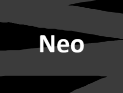

---
#
# By default, content added below the "---" mark will appear in the home page
# between the top bar and the list of recent posts.
# To change the home page layout, edit the _layouts/home.html file.
# See: https://jekyllrb.com/docs/themes/#overriding-theme-defaults
#
title: Techie Joe's Neo theme
layout: home
---
<div class="_flex my-2">
  <div class="_flex-main"></div>
  
</div>
<h1 id="_hero-title">{{ page.title | site.title }}</h1>
---

_{{ site.description }}_

Build websites with ease. Everything is pre-configured so you can start right away. Write your content in Markdown or HTML, and your site will be built directly from the code in your repository.

<a href="./preview" title="Preview the theme to see what it looks like." class="_bt -l -blue" style="width:10rem;height:3rem;font-size:1.2rem;padding:0;margin:1em 0;">Preview theme</a>
<a href="#usage" title="See how to use this template to build your websites" class="_bt -l -flat" style="width:10rem;height:3rem;font-size:1.2rem;padding:0;margin:1em 0;">Usage</a>

---

## Usage

To use the Neo theme, add the following to your site's `_config.yml`:

```yml
remote_theme: techie-joe/neo

remote_theme_build_revision: {{ site.github.build_revision }}

plugins:
- jekyll-remote-theme
# add jekyll-remote-theme to the existing plugins list if you already have one.
```

[Read more about customizing](https://github.com/techie-joe/neo?tab=readme-ov-file#customizing).